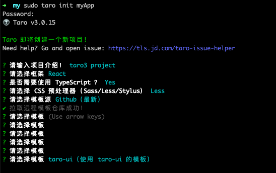
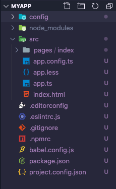

## Taro 3.x 时代

Taro 在今年 7 月份正式推出推出 3.0 版本，与 Taro1/2 编译型架构不同，Taro3 是一种解释型架构。可以让开发者获得完整的 React/Vue 等框架的开发体验。

## 升级之旅由此开始

### 项目版本信息

```
Taro: 2.1.5 -> 3.0.15
React: / -> 17.0.0
```

### 项目初始化

最初，我按照 Taro 官方提供的[迁移指南](https://taro-docs.jd.com/taro/docs/migration)上的步骤进行升级。但是由于 Taro3 的 babel 配置及 webpack 配置发生改变，有大量的 npm 包缺少或是剩余，项目报错不好排查。所以我决定采从新建项目开始，让 taro init 帮我们解决一些基本的项目配置工作。

首先全局安装 @tarojs/cli , 使用 taro 进行项目初始化。

```shell
npm install -g @tarojs/cli
taro init myApp
```

下面是我的安装选项：



因为之前的项目结构和生成的一致，这里就不对生成的项目结构进行改变，进行下一步：修改 config 配置。



### 开发配置

在上面的目录中 config 内放置的就是有关项目配置的文件，这里 taro 帮我们自动创建了三个配置文件，`dev.js`/`index.js`/ `prod.js` ，`dev.js` 对应的是开发环境的项目配置，`prod.js` 为生产环境，`index.js` 则是在开发环境和生产环境中都会用到的配置。

在开发环境中，我主要添加了路径别名，用来对路径进行缩写

```js
const path = require("path");
module.exports = {
  env: {
    NODE_ENV: '"development"',
  },
  defineConstants: {},
  mini: {},
  h5: {
    esnextModules: ["taro-ui"],
  },
  alias: {
    pages: path.resolve(__dirname, "..", "src/pages"),
    components: path.resolve(__dirname, "..", "src/components"),
    util: path.resolve(__dirname, "..", "src/util"),
    assets: path.resolve(__dirname, "..", "src/assets"),
  },
};
```

在原来的 taro2 项目中还有对 babel 的配置，由于 Taro3 的项目中自动集成了 `babel-preset-taro` 包, 并且通过 `babel.config.js` 进行 babel 配置，所以新项目的 index.js 配置文件中也不需要额外添加 babel 配置，可以自行修改 `babel.config.js`。

### 页面配置

在旧版本中，页面/项目 配置挂载在类组件的类属性或函数式的 config 属性上，通过 AST 分析取出来，生成 JSON 文件，这样无法动态生成配置。在 taro3 中，我们需要在 `页面名.config.js` ，文件中放置页面/项目的配置内容，并且该文件必须和页面/项目在同一文件夹。
