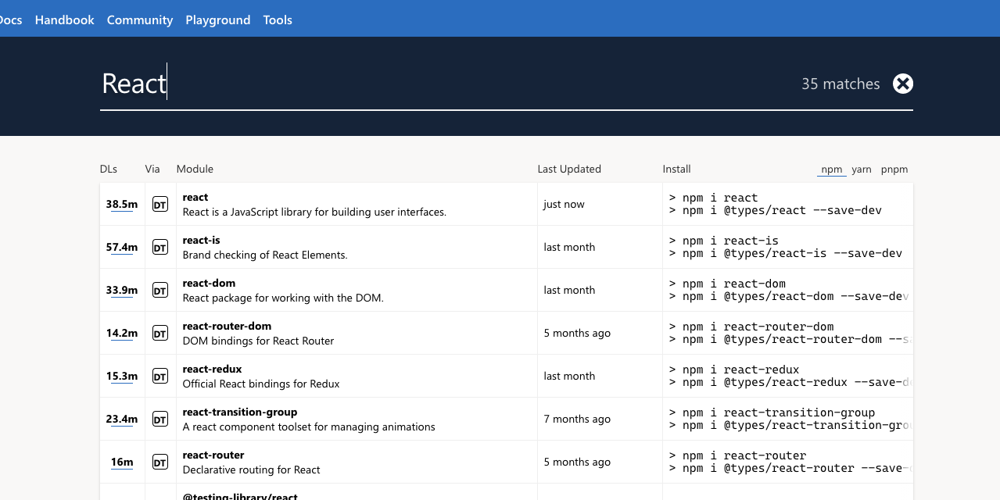

### 在 Typescript 中使用第三方库

当我们在 TS 项目中直接使用第三方库中变量会报错，

```js
wx.setNavigationBarTitle({ title: "标题" });
// 这里的 wx 会提示：Cannot find name 'wx'.
```

#### 声明文件

这是因为在 ts ts 并不知道这个 `wx` 是用来干什么的，通常情况下需要我们去定义它的使用方法。

```js
declare wx:(arguments: object) => any
```

这些声明通常我们会统一放在一个文件中，这个文件叫做**声明文件**。

声明文件的命名方式是 `xx.d.ts` , ts 在编译的时候会默认编译这类文件，使得在所有 ts 文件能使用声明文件中声明的变量、方法。

这样的定义方式显而易见很麻烦，所以有大量 的第三方库来帮我们解决这个问题，这类第三方库一般以 `@type/**` 这样的方式命名。上面提到的 `wx` 报错问题就可以用 `@types/wechat-miniprogram` 来解决。

#### Type Search

[Type Search](https://www.typescriptlang.org/dt/search?search=)中收录了这些声明文件，我们可以进行查找并安装需要的声明文件。


