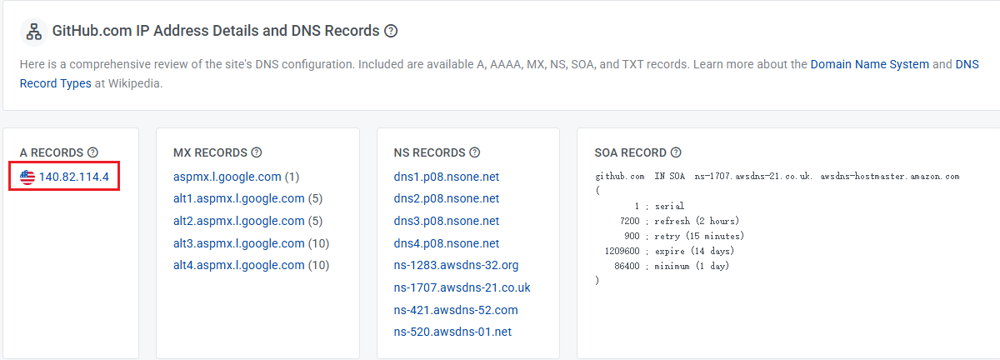

在向 github 推送代码时，有时候会遇到 push 失败的情况，报错信息如下：
```shell
fatal: unable to access ‘https://github.com/.../.git‘: Could not resolve host: github.com
```
通过配置hosts可解决
1. github ip address
https://www.ipaddress.com/website/github.com/

2. 打开 hosts 文件添加 github ip
windows 地址：`C:\Windows\System32\drivers\etc`
```shell
140.82.114.4 github.com 
```
保存 hosts 文件，如无法保存，可以尝试将 hosts 复制到其他地方修改后粘贴进去覆盖原文件
3. 尝试推送代码
```shell
git push
```
如果推送成功，恭喜你，问题解决了。


