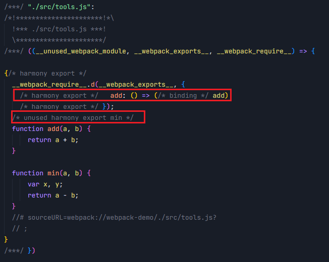

# Tree Shaking：消除无用代码的优化技术

Tree Shaking 是一种基于 ES Module 规范的**无用代码消除（Dead Code Elimination）** 技术。
它通过静态分析模块间的导入导出关系，确定哪些导出值没有被其他模块使用，并将其从最终打包产物中移除，从而优化应用体积。

这一技术最初由 Rich Harris 在 Rollup 打包工具中实现，后来 Webpack 从 2.0 版本开始引入，如今已成为前端工程中广泛应用的重要优化手段。


## 什么是 Dead Code？

Dead code（死码/无用代码）是指程序中存在的两类代码：

1. **不会被执行到的代码**（unreachable code）
2. **不影响程序运行结果的变量**（Dead Variables）

### 不会执行的代码示例

函数中在 return 语句后的代码永远不会执行：
```javascript
function name() {
  return 'xiaomi';
  var age = 18; // 永远不会执行
}
```

未执行到的语句：
```javascript
if (false) {
  // 这里的代码永远不会执行
}
```

定义了但未使用的变量：
```javascript
function add(a, b) {
  let n = 10; // 未使用的变量，可视为死码
  return a + b;
}
```

导入但未使用的模块：
```javascript
import add from './add.js';
import name from './name.js'; // 未使用的导入
// 模块 name 被导入但未使用，可视为 Dead code

add();
```

## 在 Webpack 中启用 Tree Shaking

在 Webpack 中启用 Tree Shaking 需要同时满足以下三个条件：

1. 使用 **ES Module 规范**编写模块代码（即使用 `import`/`export` 语法）
2. 配置 `optimization.usedExports` 为 `true`，启用无用导出标记功能
3. 启用代码优化功能，可通过以下任一方式实现：
   - 设置 `mode = "production"`
   - 配置 `optimization.minimize = true`
   - 提供 `optimization.minimizer` 数组自定义压缩过程

## 配置示例

```javascript
// webpack.config.js
module.exports = {
  entry: "./src/index.js",
  mode: "production",        // 生产模式自动启用优化
  devtool: false,            // 关闭源码映射以更清晰观察输出结果
  optimization: {
    usedExports: true,       // 启用无用导出标记
  },
};
```

# Tree-Shaking 的实现原理

Tree-Shaking 的实现确实基于 ES6 模块系统的静态结构特性，其核心流程分为两个关键阶段：

1. **静态分析与标记阶段**
   - 借助 ES6 模块的静态语法结构（`import`/`export`）
   - 在编译打包过程中进行模块依赖关系的静态分析
   - 精确识别哪些导出成员未被其他模块引用
   - 为未使用的导出添加特殊标记

2. **代码清除与优化阶段**
   - 在代码压缩过程中利用专业工具（如 UglifyJS、Terser）
   - 基于前一阶段的标记信息移除未被引用的代码
   - 实现最终打包产物的体积优化

这种分阶段处理方式充分发挥了 ES6 模块的静态特性优势，同时利用了现代压缩工具的强大优化能力。

## 通过 Webpack 验证 Tree-Shaking

让我们通过具体示例验证 Tree-Shaking 的实际工作过程：
初始化项目安装最新的 webpack 和 webpack-cli，当前最新版本是 v5.52.0，
```shell
mkdir tree-shaking && cd tree-shaking
npm init -y
npm i webpack webpack-cli -D
```


### 示例模块代码

**webpack.config.js**
```javascript
const path = require("path");

module.exports = {
  // 开启 development 模式，验证未压缩前的代码
  mode: "development",
  entry: "./src/index.js",
  output: {
    filename: "main.js",
    path: path.resolve(__dirname, "dist"),
  },
  optimization: {
    // 开启 usedExports  收集 Dead code 相关的信息
    usedExports: true,
  },
};

```

**index.js**
```javascript
import { add } from "./tools";

console.log(add(1,2))
```

**tools.js**
```javascript
export function add(a, b) {
  return a + b;
}

export function min(a, b) {
  var x, y;
  return a - b;
}
```

### 阶段一：静态分析与标记

打包后的位于 main.js 的 `tools.js` 代码如下：
```javascript
/***/ "./src/tools.js":
/*!**********************!*\
  !*** ./src/tools.js ***!
  \**********************/
/***/ ((__unused_webpack_module, __webpack_exports__, __webpack_require__) => {

eval("{/* harmony export */ __webpack_require__.d(__webpack_exports__, {\n/* harmony export */   add: () => (/* binding */ add)\n/* harmony export */ });\n/* unused harmony export min */\nfunction add(a, b) {\r\n  return a + b;\r\n}\r\n\r\nfunction min(a, b) {\r\n  var x, y;\r\n  return a - b;\r\n}\r\n\r\n\n\n//# sourceURL=webpack://webpack-demo/./src/tools.js?\n}");

/***/ })
```
整理后如图所示

可以看到，webpack 打包后的代码中，只有 add 函数被导出，而 min 函数没有被导出，并且 min 函数的声明以及 min 函数中未使用的变量声明 a, b 都被打包了。

在此阶段，Webpack 明确：
- 将 `add` 函数标记为需要导出的内容
- 将 `min` 函数标记为未使用的导出（`unused harmony export`）
- 保留所有函数定义以备后续优化

### 阶段二：压缩与清除

将 `webpack.config.js` 中的 `mode` 切换到 `production` ，启用 Tree Shaking，使 webpack 可运行 uglify-js 进行压缩，再次打包，

```javascript
(()=>{"use strict";console.log(3)})();
```
此阶段实现了：
- 完全移除未使用的 `min` 函数
- 将 `add(1,2)` 直接计算为字面量 `3`
- 消除所有中间变量和函数定义

## 验证结论

通过这个示例，我们验证了 Tree-Shaking 的核心机制：

1. **ES6 模块的必要性**：必须使用 `import`/`export` 语法才能启用静态分析
2. **两阶段处理流程**：先标记后清除的分阶段处理方式
3. **生产模式的重要性**：只有在生产模式下才会启用完整的代码优化
4. **压缩工具的关键作用**：Tree-Shaking 最终依赖压缩工具实现代码清除

这种基于 ES6 模块静态分析的优化策略，能够显著减少最终打包体积，是现代前端工程化的重要组成部分。


# 实践建议
## 优化导出方式

Tree Shaking 机制的核心作用点在于 ES 模块的 export 语句。需要注意的是，当遇到以下形式的导出方式时：

```javascript
export default {
    bar: 'bar',
    foo: 'foo'
}
```
即使代码中仅仅使用了这个默认导出对象的某一个属性，整个默认导出对象仍然会被完整保留在最终的打包结果中，无法被 Tree Shaking 优化移除。

因此，在实际开发过程中，应保持导出值的颗粒度，避免导出过大的对象或函数。以上代码可优化为：

```javascript
const bar = 'bar'
const foo = 'foo'

export {
    bar,
    foo
}
```


