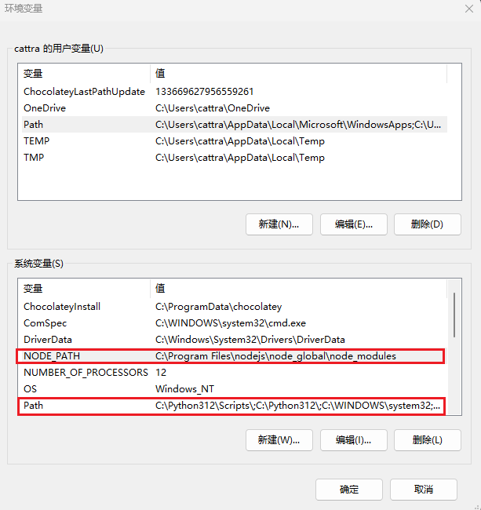

## 什么是 nvm？

**nvm** (Node Version Manager) 是一个用于管理多个 **Node.js** 版本的工具。它的全称是 **Node.js Version Management**。

**为什么需要 nvm？**
*   **项目版本兼容性**：不同的项目可能依赖于不同版本的 Node.js 和其生态工具（如 npm）。直接安装多个版本会造成冲突。
*   **无缝切换**：nvm 允许您在系统上同时安装多个 Node.js 版本，并能通过命令行在它们之间轻松、快速地切换。
*   **解决依赖问题**：当测试新版本或需要为老旧项目维护特定环境时，nvm 提供了完美的解决方案。

> **nvm 与 n 的区别**：`n` 是另一个流行的 Node.js 版本管理工具，但它主要适用于 macOS/Linux 系统。而 **nvm** 同时支持 macOS/Linux 和 **Windows**（但 Windows 版是一个独立项目，名为 `nvm-windows`）。

---
## **Windows 系统完全卸载 Node.js 指南**
在安装 nvm 之前，需要先卸载系统中已有的 Node.js 版本。
为了确保彻底卸载 Node.js，请按照以下步骤操作：

### **步骤一：通过系统设置卸载主程序**

1.  打开 **控制面板**。
2.  点击 **“程序”** > **“程序和功能”**。
3.  在程序列表中找到并选中 **“Node.js”**。
4.  点击顶部的 **“卸载”** 按钮，并遵循屏幕提示完成主程序的卸载。

### **步骤二：清理残留文件和目录**

即使卸载了主程序，一些文件可能仍然残留。请手动检查并删除以下目录（如果存在）：

1.  **Node.js 安装目录**（默认通常在）：
    *   `C:\Program Files\nodejs\`
2.  **npm 缓存和全局模块目录**（通常位于）：
    *   `%AppData%\npm\` （在文件资源管理器地址栏直接输入即可）
    *   `%AppData%\npm-cache\`

>要确认 Node.js 的确切安装路径，可以按以下方式：
> *   打开**命令提示符 (cmd)**。
> *   输入命令 `where node` 并回车。
> *   系统会列出所有已知的 node.exe 路径，这可以帮助您定位需要删除的文件夹。

### **步骤三：清理环境变量**

为了防止系统继续寻找已删除的 Node.js 文件，需要移除其环境变量。

1.  在开始菜单或搜索栏中输入 **“编辑系统环境变量”** 并打开它。
2.  在弹出的窗口中，点击下方的 **“环境变量”** 按钮。
3.  在 **“用户变量”** 区域中，查找名为 `Path` 的变量，选中它并点击 **“编辑”**，找到 nodejs 相关变量进行删除。
    
4.  在 **“系统变量”** 区域中，删除 `NODE_PATH` 变量，并查看 `Path` 变量中是否有 nodejs 相关变量，如有则删除。 
    
5.  保存所有更改。

### **步骤四：验证卸载是否成功**

完成所有操作后，建议重启命令提示符或电脑，然后进行最终验证：

1.  打开一个新的**命令提示符**窗口。
2.  分别输入以下命令并回车：
    *   `node -v`
    *   `npm -v`
3.  如果系统返回 `'node' 不是内部或外部命令...` 之类的错误信息，则表明 Node.js 已被成功卸载。

现在，您的系统已彻底清除 Node.js，可以安装新的版本了。

## **nvm Windows 系统下载与安装指南**

#### **第一步：下载 nvm**

1.  访问 **nvm-windows** 项目的官方 GitHub 发布页面：
    [https://github.com/coreybutler/nvm-windows/releases](https://github.com/coreybutler/nvm-windows/releases)

2.  在 "Assets" 部分，找到最新的安装程序。通常选择 **`nvm-setup.exe`** 文件进行下载。该版本提供了安装向导，能自动配置环境变量，是最推荐的方式。

    > **注意**：请始终从官方 GitHub 页面获取最新版本，以确保安全性和功能性。您提供的 `v1.2.2` 仅为举例，请以网站实际的最新版本为准。


3. github 下载网速较慢可以通过 [https://nvm.uihtm.com/doc/download-nvm.html](https://nvm.uihtm.com/doc/download-nvm.html) 下载。

#### **第二步：运行安装程序**

1.  双击下载好的 **`nvm-setup.exe`**。
2.  遵循安装向导的提示：
    *   **同意许可协议**。
    *   **设置 nvm 的安装路径**（例如：`C:\Users\[YourUserName]\AppData\Roaming\nvm`）。建议保持默认。
3.  点击安装，等待完成。

#### **第三步：验证安装**

安装完成后，打开一个**全新**的命令提示符 (CMD) 或 PowerShell 窗口，输入以下命令：

```bash
nvm -v
```
如果安装成功，该命令会输出当前安装的 nvm 版本号（例如 `1.2.2`）。

#### **第五步：开始使用 nvm**

安装好 nvm 后，就可以轻松管理 Node.js 版本了。以下是一些最常用的命令：

*   **安装指定版本的 Node.js**：
    ```bash
    nvm install 18.17.0  # 安装最新版的 18.17.x
    nvm install 20.5.0   # 安装最新版的 20.5.x
    nvm install lts      # 安装最新的长期支持 (LTS) 版本
    ```

*   **查看已安装的所有版本**：
    ```bash
    nvm list
    ```

*   **切换要使用的 Node.js 版本**：
    ```bash
    nvm use 18.17.0
    ```

*   **查看所有可安装的远程版本**：
    ```bash
    nvm list available
    ```


