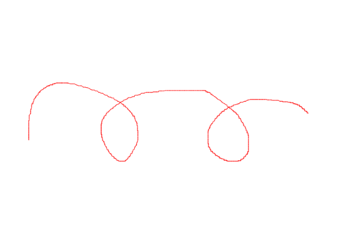
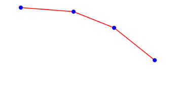
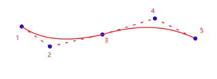
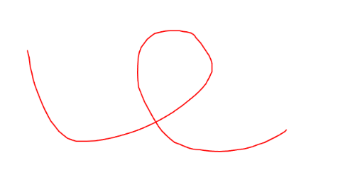

# 背景概要  

在有次面试时，讲到 canvas 项目面试官问到 “怎么解决 canvas 绘画时的锯齿感”。在编写 canvas 绘画代码时，其实因为经常用ps，有意识到所谓“锯齿感”是因为canvas 在绘制线条时是通过“点对点”连接的形式，所以把它默认为一种正常情况，没有想过怎么优化。这段时间研究了下发现 canvas 已经提供给我们解决的 api，下面讲解下解决方式。



# 问题分析

## 1. 首先通过 React 实现 canvas 画板

```jsx
import { useEffect, useRef, useState, MouseEvent } from "react";
interface CanvasState {
  isDrawing: boolean;
  startX: number;
  startY: number;
}
export default function Page() {
  // 1. 创建画布
  const canvasRef = useRef<HTMLCanvasElement>(null);
  //  2. 保存画布的状态
  const [state, setState] = useState<CanvasState>({
    isDrawing: false,
    startX: 0,
    startY: 0,
  });
  useEffect(() => {
    if (!canvasRef.current) return;
    // 3. 获取画布的上下文
    const ctx = canvasRef.current.getContext("2d");
    if (!ctx) return;
    // 4. 设置线条样式
    ctx.strokeStyle = "red";
    ctx.lineWidth = 1;
    ctx.lineCap = "round";
  }, []);

  const onMouseDown = (e: MouseEvent) => {
    // 5. 鼠标按下时，记录起始坐标，并设置 isDrawing 为 true，开启会话状态
    setState({
      ...state,
      isDrawing: true,
      startX: e.nativeEvent.clientX,
      startY: e.nativeEvent.clientY,
    });
  };

  const onMouseMove = (e: MouseEvent) => {
    if (!state.isDrawing) return;

    const canvas = canvasRef.current;
    if (!canvas) return;

    const ctx = canvas.getContext("2d");
    if (!ctx) return;
    // 6. 鼠标移动时，根据起始坐标和当前坐标，绘制一条线
    const endX = e.nativeEvent.clientX;
    const endY = e.nativeEvent.clientY;
    ctx.beginPath();
    ctx.moveTo(state.startX, state.startY);
    ctx.lineTo(endX, endY);
    // 7. 绘制线
    ctx.stroke();
    // 8. 关闭路径
    ctx.closePath();
    // 9. 设置下次绘画的起始坐标
    setState({
      ...state,
      startX: endX,
      startY: endY,
    });
  };

  const onMouseUp = () => {
    if (!state.isDrawing) return;
    // 10. 鼠标松开时，关闭绘画状态
    setState({ ...state, isDrawing: false });
  };

  const clearCanvas = () => {
    const canvas = canvasRef.current;
    if (!canvas) return;
    const ctx = canvas.getContext("2d");
    if (!ctx) return;
    ctx.clearRect(0, 0, canvas.width, canvas.height);
  };

  return (
    <div>
      <canvas
        ref={canvasRef}
        width="800"
        height="500"
        style={{ border: "1px solid gray" }}
        onMouseDown={onMouseDown}
        onMouseMove={onMouseMove}
        onMouseUp={onMouseUp}
        onMouseLeave={onMouseUp}
      ></canvas>
      <button onClick={clearCanvas}>清空</button>
    </div>
  );
}
```


## 2. 锯齿感造成原因

我们在 canvas 上绘制4个点，并用线链接他们。

```jsx
useEffect(() => {
    if (!canvasRef.current) return;
    // 3. 获取画布的上下文
    const ctx = canvasRef.current.getContext("2d");
    if (!ctx) return;
    // 4. 设置线条样式
    ctx.strokeStyle = "red";
    ctx.lineWidth = 2;
    ctx.lineCap = "round";

    // 起始点和结束点
    ctx.fillStyle = "blue";
    const point1 = {
      x: 100,
      y: 20,
    };
    const point2 = {
      x: 230,
      y: 30,
    };
    const point3 = {
      x: 330,
      y: 70,
    };
    const point4 = {
      x: 430,
      y: 150,
    };

    ctx.beginPath();
    ctx.moveTo(point1.x, point1.y);
    ctx.lineTo(point2.x, point2.y);
    ctx.stroke();
    ctx.closePath();

    ctx.beginPath();
    ctx.moveTo(point2.x, point2.y);
    ctx.lineTo(point3.x, point3.y);
    ctx.stroke();
    ctx.closePath();

    ctx.beginPath();
    ctx.moveTo(point3.x, point3.y);
    ctx.lineTo(point4.x, point4.y);
    ctx.stroke();
    ctx.closePath();

    ctx.beginPath();
    ctx.arc(point1.x, point1.y, 5, 0, 2 * Math.PI); // 起始点
    ctx.fill();

    ctx.beginPath();
    ctx.arc(point2.x, point2.y, 5, 0, 2 * Math.PI);
    ctx.fill();

    ctx.beginPath();
    ctx.arc(point3.x, point3.y, 5, 0, 2 * Math.PI); //
    ctx.fill();

    ctx.beginPath();
    ctx.arc(point4.x, point4.y, 5, 0, 2 * Math.PI); // 结束点
    ctx.fill();
  }, []);
```




可以看到，线条连接后呈现出来的是一段段“折现”，并非是一条整体平滑的曲线。结合我们在 canvas 通过鼠标移动绘制可以明白：

1.  Canvas的 `lineTo` 方法使用直线连接相邻两点，而不是曲线。
2. 浏览器通过  `mousemove` 采集鼠标移动坐标的频率有限，无法捕捉每一个像素点的移动。
3. 鼠标移动越快，采集到的点间距越大，直线连接后的 “折线” 越明显。
4. 把一段线条放大后就像下图，所以整个画面会呈现 “锯齿感”“毛边”这样的感觉。


# 如何解决 

## 二次贝塞尔曲线

canvas 提供了一个api `quadraticCurveTo`，它用于绘制二次贝塞尔曲线。

`quadraticCurveTo(cpx, cpy, x, y)`  ，它需要 2 个点。cpx, cpy 是控制点，x, y 是终点。在创建二次贝赛尔曲线之前，可以使用 `moveTo` 设置绘制起始点。

```jsx
// 1. 开始绘制二次贝塞尔曲线
ctx.beginPath();
// 2. 设置绘制起始点
ctx.moveTo(20, 110);
// 3. 传入控制点，终点
ctx.quadraticCurveTo(230, 150, 250, 20);
ctx.stroke();

// 起始点和结束点
ctx.fillStyle = "blue";
ctx.beginPath();
ctx.arc(20, 110, 5, 0, 2 * Math.PI); // 起始点
ctx.arc(250, 20, 5, 0, 2 * Math.PI); // 结束点
ctx.fill();

// 控制点
ctx.fillStyle = "red";
ctx.beginPath();
ctx.arc(230, 150, 5, 0, 2 * Math.PI);
ctx.fill();
```


在这个示例中，控制点是红色的，起始点和结束点是蓝色的。

## 实现过程

那么如何将二次贝塞尔曲线结合到我们绘制过程中，让我们可以绘制出平滑曲线呢？

在我们绘制过程中有 1,2,3 三个点，以往是从1连到2再连到3，如下图虚线。

现在我们把1看作 二次贝塞尔曲线中的开始点，2为控制点，3为结束点进行连接，即可得到实线部分。以此类推……



基于上述思路，代码实现：

```jsx
import { useEffect, useRef, useState, MouseEvent } from "react";
interface CanvasState {
  isDrawing: boolean;
}
export default function Page() {
  const canvasRef = useRef<HTMLCanvasElement>(null);
  const [state, setState] = useState<CanvasState>({
    isDrawing: false,
  });
  const pointsRef = useRef<{ x: number; y: number }[]>([]);

  useEffect(() => {
    if (!canvasRef.current) return;
    const ctx = canvasRef.current.getContext("2d");
    if (!ctx) return;
    ctx.strokeStyle = "red";
    ctx.lineWidth = 2;
    ctx.lineCap = "round";
  }, []);

  const onMouseDown = (e: MouseEvent) => {
    setState({
      isDrawing: true,
    });

    pointsRef.current.push({
      x: e.nativeEvent.clientX,
      y: e.nativeEvent.clientY,
    });
  };

  const onMouseMove = (e: MouseEvent) => {
    if (!state.isDrawing) return;

    const canvas = canvasRef.current;
    if (!canvas) return;

    const ctx = canvas.getContext("2d");
    if (!ctx) return;
    const point = {
      x: e.nativeEvent.clientX,
      y: e.nativeEvent.clientY,
    };
    pointsRef.current.push(point);

    if (pointsRef.current.length == 3) {
      // 开始点为点 1
      const startPoint = pointsRef.current[0];
      // 控制点为点 2
      const controlPoint = pointsRef.current[1];
      // 结束点为点 3
      const endPoint = pointsRef.current[2];
      ctx.beginPath();
      ctx.moveTo(startPoint.x, startPoint.y);
      ctx.quadraticCurveTo(
        controlPoint.x,
        controlPoint.y,
        endPoint.x,
        endPoint.y
      );
      ctx.stroke();
      ctx.closePath();
      // 清空点数组，结束点为开始点，准备下一次绘制
      pointsRef.current = [endPoint];
    }
  };

  const onMouseUp = () => {
    if (!state.isDrawing) return;
    setState({ isDrawing: false });
  };

  const clearCanvas = () => {
    const canvas = canvasRef.current;
    if (!canvas) return;
    const ctx = canvas.getContext("2d");
    if (!ctx) return;
    ctx.clearRect(0, 0, canvas.width, canvas.height);
  };

  return (
    <div>
      <canvas
        ref={canvasRef}
        width="800"
        height="500"
        style={{ border: "1px solid gray" }}
        onMouseDown={onMouseDown}
        onMouseMove={onMouseMove}
        onMouseUp={onMouseUp}
        onMouseLeave={onMouseUp}
      ></canvas>
      <button onClick={clearCanvas}>清空</button>
    </div>
  );
}
```

重新打开页面进行绘制，可以看到在绘画时，线条平滑了很多。



如果想要进一步平滑曲线，可以通过调整绘制内跳绘制的点，如下：

```jsx
 if (pointsRef.current.length == 7) {
      // 开始点为点 1
      const startPoint = pointsRef.current[0];
      // 控制点为点 2
      const controlPoint = pointsRef.current[3];
      // 结束点为点 3
      const endPoint = pointsRef.current[6];
      ctx.beginPath();
      ctx.moveTo(startPoint.x, startPoint.y);
      ctx.quadraticCurveTo(
        controlPoint.x,
        controlPoint.y,
        endPoint.x,
        endPoint.y
      );
      ctx.stroke();
      ctx.closePath();
      // 清空点数组，结束点为开始点，准备下一次绘制
      pointsRef.current = [endPoint];
 }
```

本文到此结束，如果有更多关于优化Canvas画面锯齿效果的创新思路、实践经验或技术方案，欢迎分享~


