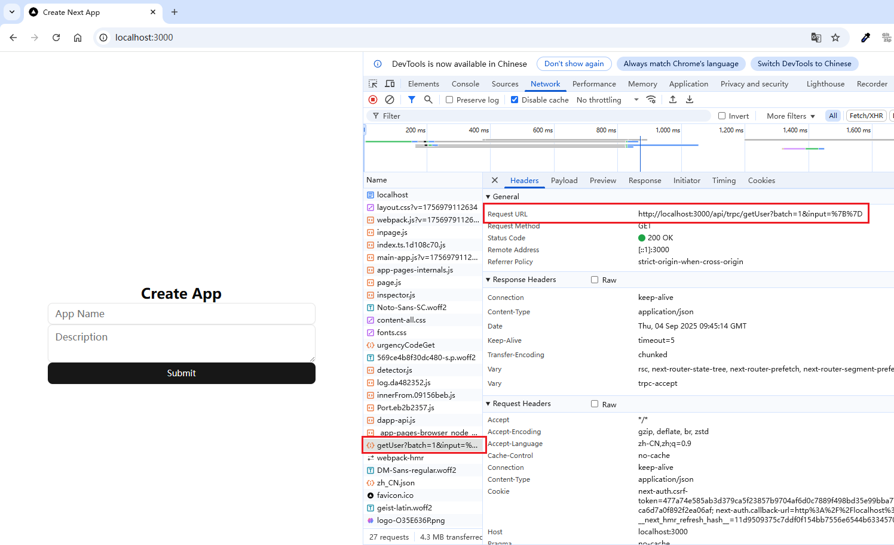
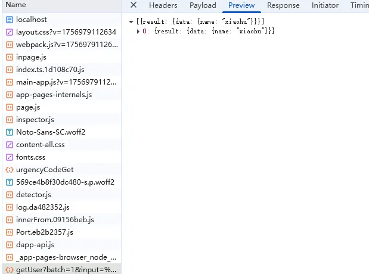
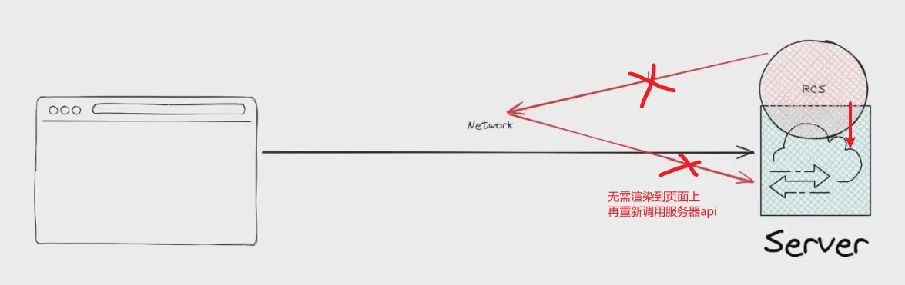
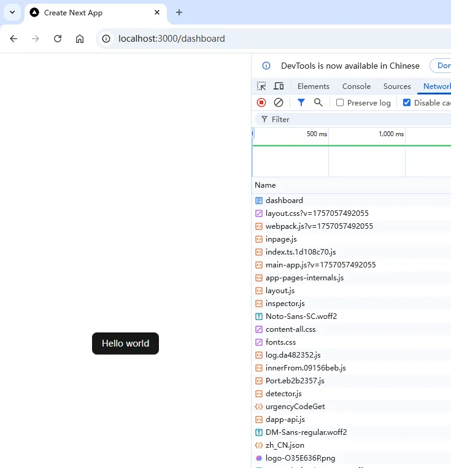

# 介绍
[tRPC](https://trpc.io/) 在 Next.js 中用于创建类型安全的API，它允许客户端直接调用服务器端的函数（API），并享受完整的 TypeScript 类型推断。

+ 实现客户端与服务端的 api 同步，可以帮我们在客户端同步server api，并且同步调用 server api。
+ 使用 tRPC 不用关心请求方式，tRPC 全都封装好了，使用的是 tRPC 的 api client。
+  tRPC 在原生http请求上有很多优化，比如原生请求三个数据，tRPC 会把他汇聚成一个http请求。

# tRPC 在 Next 中使用
## 1. 安装依赖
```bash
npm install @trpc/server @trpc/client
```

## 2. 创建路由器
首先，让我们初始化 tRPC router。

```plain
import { initTRPC } from "@trpc/server";

const t = initTRPC.create();
export const router = t.router;
export const procedure = t.procedure;
```

接下来，我们将初始化主路由器实例（这里用 getNameRouter 举例）。

```plain
import { initTRPC } from "@trpc/server";

const t = initTRPC.create();
export const router = t.router;
export const procedure = t.procedure;

export const appRouter = router({
  app: procedure.query(async () => {
    return { name: "xiaohu" };
  }),
});

export type AppRouter = typeof appRouter;
```

## 3. 通过 handler 配置 Next API 路由
tRPC 作为一个 API 框架，需要集成到现有的服务器环境中运行，例如 Next.js API Route、Express 或 Node.js 原生 HTTP 服务器。其核心价值在于提供类型安全的远程过程调用（RPC）能力，而与此底层服务器无关。

为了适配不同的后端环境，tRPC 提供了特定的 “适配器”（Adapter） ，例如 `@trpc/server/adapters/fetch` 或 `@trpc/server/adapters/express`。这些适配器中的 `**handler**` 函数充当了关键的桥梁角色，它负责：

1. 标准化输入/输出：将不同服务器框架（如 Next Request/Response）的特定请求/响应对象，转换为 tRPC 能够处理的统一格式。
2. 路由调度：接收传入的 HTTP 请求，并将其分派给正确的 tRPC 过程（Procedure）进行处理。
3. 上下文创建：为每个请求生成上下文（Context），可以在其中注入身份验证信息、数据库连接等。

下面我们通过 `fetch`handler 创建 api route。

```typescript
import { fetchRequestHandler } from "@trpc/server/adapters/fetch";
import { appRouter } from "@/utils/trpc";
import { NextRequest } from "next/server";

export const handler = (request: NextRequest) => {
  return fetchRequestHandler({
    endpoint: "/api/trpc",
    req: request,
    router: appRouter,
    createContext: () => ({}),
  });
};

export { handler as GET, handler as POST };
```

## 4. 在客户端使用
我们已经创建好了 api route，接下来要如何使用呢？

### 4.1 创建 tRpc 客户端。
**创建 tRPC 客户端的主要目的是为了我们你能在前端（如 React 组件中）像调用本地函数一样，安全、方便地调用后端 API**。手动构造 HTTP 请求，比如 `fetch('/api/user/123')`。

```typescript
import type { AppRouter } from "@/utils/trpc";

export const trpcClient = createTRPCClient<AppRouter>({
  links: [
    httpBatchLink({
      url: "http://localhost:3000/api/trpc",
    }),
  ],
});
```

### 4.2 在客户端页面中调用 api
```tsx
"use client";
import { Button } from "@/components/ui/button";
import { Input } from "@/components/ui/input";
import { Textarea } from "@/components/ui/textarea";
import { useEffect } from "react";
// 1. 引入trpc的client
import { trpcClient } from "@/utils/api";

export default function Home() {
  useEffect(() => {
    // 2. 调用trpc的 app api
    trpcClient.app.query();
  }, []);
  return (
    <div className="h-screen flex items-center justify-center">
      <form className="w-full max-w-md flex flex-col" action="">
        <h1 className="text-center text-2xl font-bold">Create App</h1>
        <Input name="name" placeholder="App Name" />
        <Textarea name="description" placeholder="Description" />
        <Button type="submit">Submit</Button>
      </form>
    </div>
  );
}
```

这时打开页面可以看到我们调用 getName api 发送的请求，及返回数据。





# tRPC api Context 及 Middleware
tRPC handler 可以向我们的 api router 传递 Context，和 express middleware 类似。

首先创建 createContextInner 函数，用于获取上下文。

```typescript
// 封装 createContextInner 
export async function createContextInner() {
  const session = await getServerSession();
  if (!session) {
    // TRPCError 会自动处理 401 状态码
    throw new TRPCError({
      code: "UNAUTHORIZED",
      message: "session is null",
    });
  } else {
    return {
      session,
    };
  }
}
```

给我们的trpc handler route 设置 createContext。

```tsx
import { fetchRequestHandler } from "@trpc/server/adapters/fetch";
import { createContextInner, appRouter } from "@/utils/trpc";
import { NextRequest } from "next/server";

export const handler = (request: NextRequest) => {
  return fetchRequestHandler({
    endpoint: "/api/trpc",
    req: request,
    router: appRouter,
    // 传入 createContextInner
    createContext: createContextInner,
  });
};

export { handler as GET, handler as POST };
```

调用此 api 时就可以在 createContextInner 进行 context 处理。

下面是 middleware 使用方法。

```typescript
// 1. 创建 middleware
const middleware = t.middleware(async (opts) => {
  const start = Date.now();
  const result = await opts.next();
  const durationMs = Date.now() - start;

  const meta = { path: opts.path, type: opts.type, durationMs };
  result.ok
    ? console.log("OK request timing:", meta)
    : console.error("Non-OK request timing", meta);
  return result;
});

// 2. 应用 middleware，定义新的 procedure
const loggedProcedure = procedure.use(middleware);

// 4. 可以定义专门用于校验用户登录的 middleware
const checkedLoginMiddleware = t.middleware(async ({ ctx, next }) => {
  if (!ctx.session?.user) {
    throw new TRPCError({
      code: "UNAUTHORIZED",
      message: "session is null",
    });
  }
  return next();
});
const checkedProcedure = procedure.use(checkedLoginMiddleware);

export const appRouter = router({
  // 3. 更换路由上的 procedure
  app: loggedProcedure.query(async ({ ctx }) => {
    console.log("%c Line:38 🍏 ctx", "color:#7f2b82", ctx);
    return { ...ctx };
  }),
  // 5. 校验登录后才能访问的路由
  hello: checkedProcedure.query(async ({ ctx }) => {
    return { hello: "Hello world" };
  }),
});
```


# tRPC 在 React 客户端集成
在 React 项目中，可以使用  **TanStack Query **进行客户端集成**。**

**TanStack Query 的核心作用是，它专门负责高效地管理、缓存和同步你的应用中的【异步数据】（尤其是来自服务器端的数据）。**

## 设置 tRpc context
```typescript
import { createTRPCClient, httpBatchLink } from "@trpc/client";
import type { AppRouter } from "@/utils/trpc";
import { createTRPCContext } from "@trpc/tanstack-react-query";

export const trpcClient = createTRPCClient<AppRouter>({
  links: [
    httpBatchLink({
      url: "http://localhost:3000/api/trpc",
    }),
  ],
});

// 定义 TRPC 上下文
const trpcContext = createTRPCContext<AppRouter>();
export const TRPCProviderReact = trpcContext.TRPCProvider;
export const { useTRPC, useTRPCClient } = trpcContext;
```

然后，创建一个 **`TRPCProvider`客户端组件**，并将页面包裹在`TRPCProvider`中。

```tsx
"use client";
import { ReactNode } from "react";
import { QueryClient, QueryClientProvider } from "@tanstack/react-query";
import { TRPCProviderReact, trpcClient } from "@/utils/api";

export function TRPCProvider({ children }: { children: ReactNode }) {
  const queryClient = new QueryClient();
  return (
    <QueryClientProvider client={queryClient}>
      <TRPCProviderReact trpcClient={trpcClient} queryClient={queryClient}>
        {children}
      </TRPCProviderReact>
    </QueryClientProvider>
  );
}
```

```tsx
import type { Metadata } from "next";
import { Geist, Geist_Mono } from "next/font/google";
import "./globals.css";
import { TRPCProvider } from "./TRPCProvider";

// ... 其他代码
export default function RootLayout({
  children,
}: Readonly<{
  children: React.ReactNode;
}>) {
  return (
    <html lang="en">
      <body
        className={`${geistSans.variable} ${geistMono.variable} antialiased`}
      >
        <TRPCProvider>{children}</TRPCProvider>
      </body>
    </html>
  );
}

```

## 在 client 调用 api 
```tsx
"use client";
import { Button } from "@/components/ui/button";
import { useTRPC } from "@/utils/api";
import { useQuery } from "@tanstack/react-query";

export default function Home() {
  // 获取已配置好的 tRPC 客户端实例和工具函数
  // 这个 useTRPC 必须在使用了 TRPCProvider 包裹的 客户端 组件内使用
  const trpc = useTRPC();
  // 使用 React Query 的 useQuery hook 发起一个 tRPC 查询请求
  // trpc.hello.queryOptions() 生成一个包含查询键(key)和查询函数(queryFn)的选项对象
  // useQuery 返回的对象中，包含该请求的 data/isLoading/error 等状态
  const { data, isLoading, error } = useQuery(trpc.hello.queryOptions());
  return (
    <div className="h-screen flex items-center justify-center">
      <Button type="submit">{isLoading ? "Loading" : data?.hello}</Button>
    </div>
  );
}

```
# 服务器端调用
当我们从 server component 在请求 api 时，由于  server component 和 api 在同一服务器上，这时我们期望无需重新建立 http 连接，可以直接调用服务端函数。

`createCallerFactory()` 可以帮我们实现此功能，它是 tRPC 服务器端的一个高级工具函数，它的主要目的是在你的服务器端代码中，创建一个能够直接调用你定义的 tRPC 过程（procedures）的“调用器”（caller），而无需发起一个 HTTP 请求。



 创建一个 tRPC `createCallerFactory()` ，它基于已定义的应用路由器(appRouter)，这个createCallerFactory 可以用来创建能够直接调用路由器中所有过程的调用器实例。

```tsx
const t = initTRPC.create();
const { router, procedure, createCallerFactory } = t;

// ... appRouter
export const createCaller = createCallerFactory(appRouter);
```

在服务端，通过 createCaller 实例 caller 对服务端api进行调用。

```jsx
import { Button } from "@/components/ui/button";
import { createContextInner, createCaller } from "@/utils/trpc";

export default async function Home() {
  const ctx = await createContextInner();
  const caller = createCaller(ctx);
  const data = await caller.hello();

  return (
    <div className="h-screen flex items-center justify-center">
      <Button type="submit">{data.hello}</Button>
    </div>
  );
}

```

打开页面可看到，在浏览器没有发送http请求仍然显示了 "Hello world" 内容，此时是通过服务端直接调用显示的数据。




